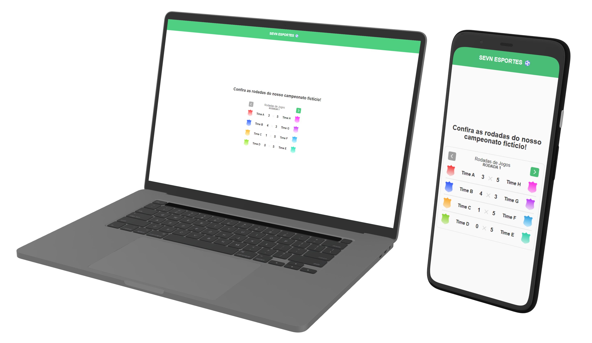

<h1 align="center">
  
</h1>

<h3 align="center">
  Sevn Esportes ⚽
</h3>

Aplicação Web sobre as rodadas do campeonato.

<a href="#-sobre-o-projeto">Sobre o projeto</a> •
<a href="#-tecnologias">Tecnologias</a>

## ✅ Sobre o projeto (🚩[Clique aqui](https://youtu.be/4oUe9C9z7eE) para ver um vídeo de apresentação)

Este projeto é uma aplicação para a vaga de desenvolvedor front-end na Sevn. A proposta do mesmo foi construir uma interface para visualização das rodadas de um campeonato fictício utilizando HTML, CSS e JS.

## 🚀 Tecnologias

Tecnologias que usei para desenvolver a aplicação:

- [HTML](https://www.w3schools.com/html/)
  
- [CSS](https://www.w3schools.com/css/)

- [JavaScript](https://developer.mozilla.org/en-US/docs/Web/JavaScript)
  
## 🚀 Deploy da aplicação com Github Pages

> https://klayverxd.github.io/teste-pleno-frontend-sevn/
